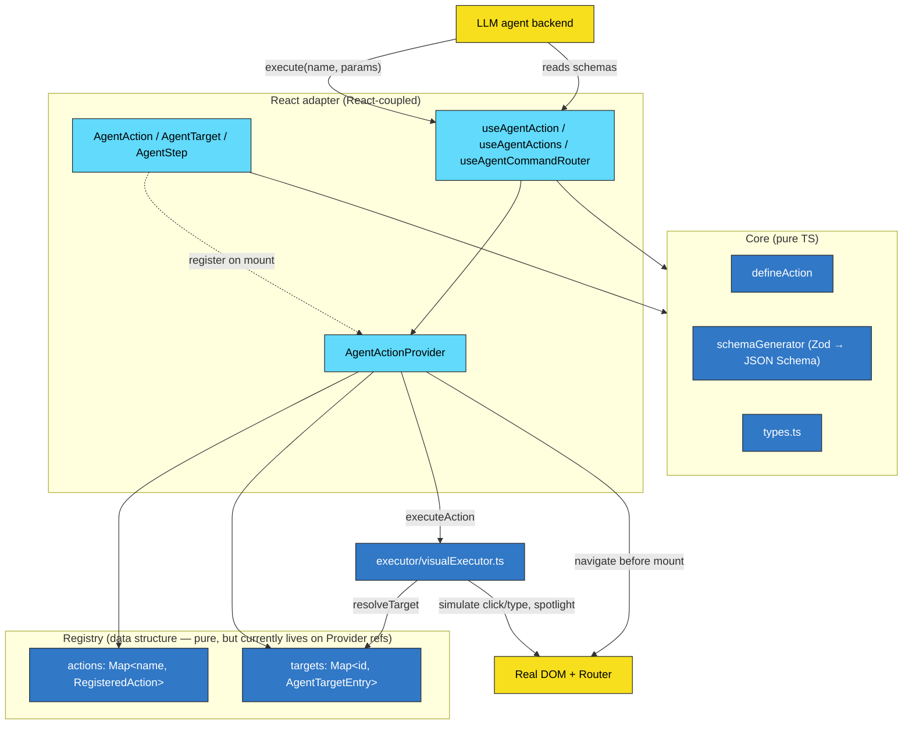
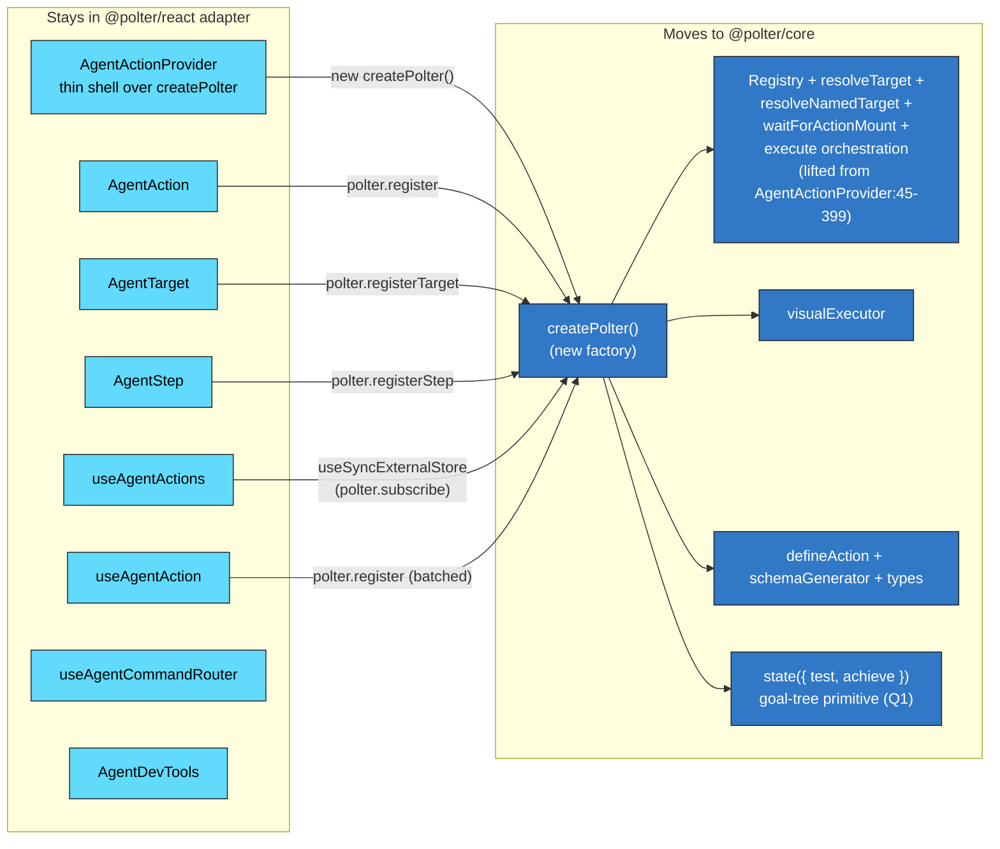
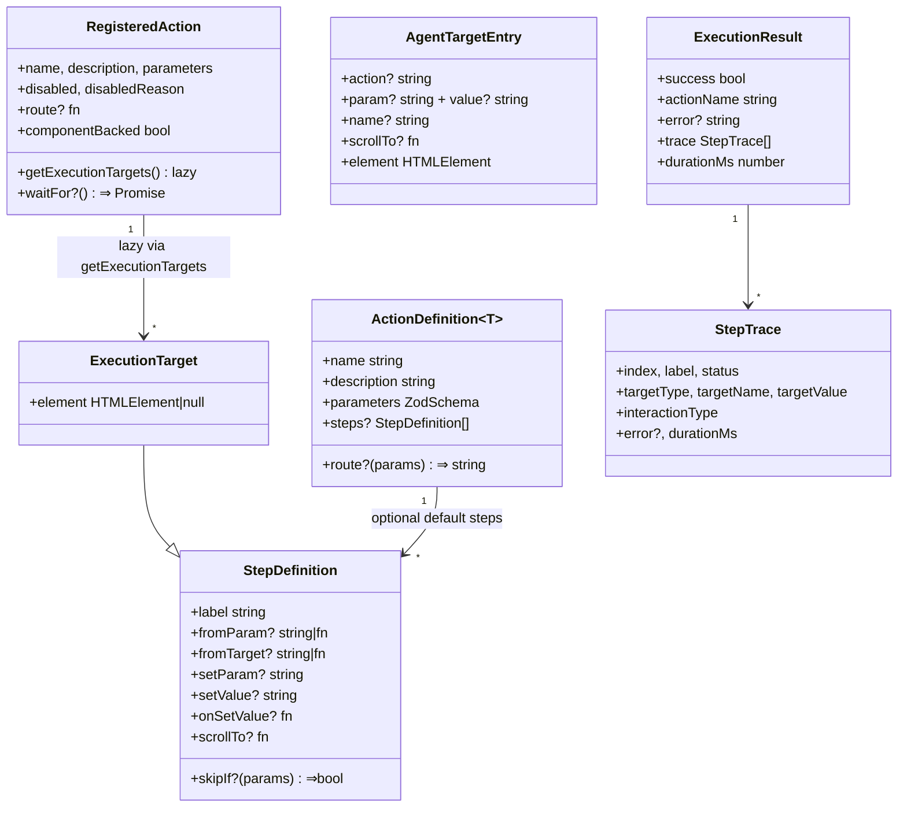
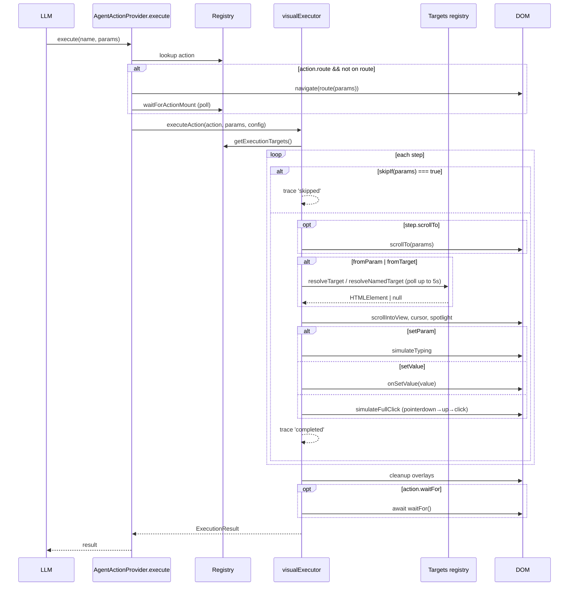
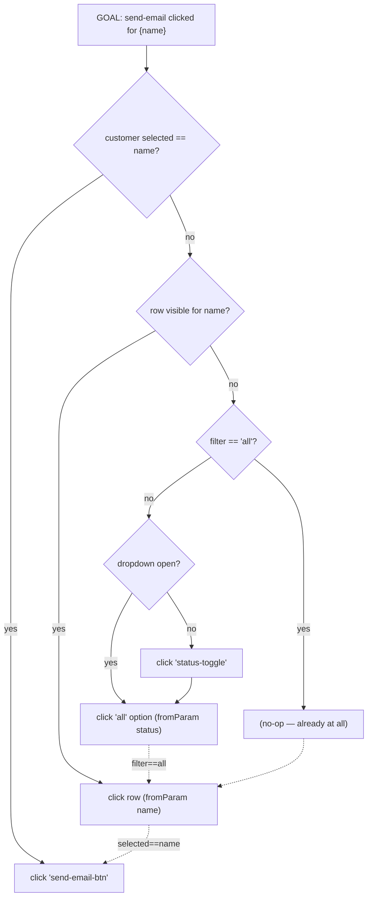

# Polter architecture — working document

## Context

This file started as "does Polter need React?" and has widened into a living architecture review. It exists because:

- The React layer feels in-between — neither pulling its weight nor staying out of the way.
- Authoring `skipIf` chains for multi-step actions is the biggest current pain (see `examples/basic/src/App.tsx:116-136`), and it's a symptom of the steps model being shaped wrong.
- A handful of design questions are stacking up (results from actions, async/abort, structured UI state, type safety, non-UI tools, navigation auto-gen) and need a shared map before we triage.

The goal is to map the system as it stands, surface where the seams want to be, and use the diagrams as a substrate for triage on the open questions.

## Diagram tooling decision

**Primary: Mermaid.** Text-in-repo, renders inline in GitHub/Claude Code/doc sites, diffs cleanly. Good enough for class, sequence, state, and flow diagrams at this scale.

**Escape hatches:**
- **Graphviz/DOT** if we ever need a dense (>30 node) dependency graph — none today.
- **Excalidraw → PNG in `docs/img/`** for marketing/landing visuals where aesthetics matter. Don't try to make Mermaid pretty.

Diagrams live in this file so they evolve with the code.

---

## Current architecture

### 1. Layer overview — colored by React coupling

Cyan = React-coupled. Blue = pure TS (no React import). Yellow = external (LLM, DOM, Router).



**What this surfaces:** the React-coupled surface is *only* the four boxes in the top subgraph (Provider + 3 component types + 3 hooks). Everything below — `core/`, the registry data structures, the executor — is already pure TS today. The cyan/blue line is roughly the same line as `src/components/` + `src/hooks/` vs. `src/core/` + `src/executor/`. About 60/40 React-to-pure by line count, but the pure side contains all the *behavior* and the React side is mostly lifecycle wiring.

### 1b. The React boundary, isolated

What would move into a framework-neutral `@polter/core` vs. stay in a `@polter/react` adapter, if we did the Phase 1 lift:



**What this surfaces:** the adapter surface is small (8 thin shells) and homogeneous (all just call `polter.register*` in lifecycle hooks). A `@polter/vue` or `@polter/vanilla` would mirror this same shape. `AgentDevTools` is the lone fat React-only component; it stays in the adapter because it *is* a UI.

### 2. Type relationships



Things to notice:
- `ExecutionTarget extends StepDefinition` — the executor's working type is just a step plus a resolved element slot.
- Steps live in **two** places: on `ActionDefinition` (defaults from `defineAction`) and in `useAgentAction({ steps })` / `<AgentStep>` (component override). The override always wins. This is why `getExecutionTargets()` is a lazy getter — it must read whichever is freshest.
- `AgentTargetEntry` is independent of any action by default; `action?:` scopes it to one action when needed (e.g., `<AgentTarget action="find_and_email" name="send-email-btn">`).

### 3. Registration lifecycle

```mermaid
sequenceDiagram
  participant App as App tree (React)
  participant Comp as &lt;AgentAction action={x}&gt;
  participant Provider as AgentActionProvider
  participant Reg as Registry refs
  participant LLM

  App->>Comp: mount(action prop)
  Comp->>Provider: registerAction(name, getExecutionTargets, ...)
  Provider->>Reg: actions.set(name, registered)
  Provider->>Provider: setVersion(v+1) — triggers re-render
  Provider-->>App: new schemas/availableActions

  LLM->>Provider: useAgentActions().schemas
  Provider-->>LLM: tool schemas

  App->>Comp: unmount (e.g. route change)
  Comp->>Provider: unregisterAction(name)
  Provider->>Reg: actions.delete(name)
  Provider->>Provider: setVersion(v+1)
```

### 4. Execute flow



### 5. The pain visualised — current `find_and_email` as a goal tree

The current linear `steps[]` form is implicitly encoding this tree, with `skipIf` doing the test work at every node:



Today the user authors this tree as a flat list of 5 steps, each carrying a hand-written `skipIf` that tests every prefix that might already be satisfied. That's why the conditions get gnarly (`skipIf: ({ name }) => filtered.some(c => c.name === name) || statusFilter === 'all' || dropdownOpen`).

---

## Open questions

Each item: current state, leaning, what diagram or design move it implies. Numbered for reference in discussion.

### Q1. Step dependencies — flat list vs. goal tree

**Today:** `steps: StepDefinition[]` with hand-written `skipIf`. Authors flatten a tree into a list.

**Leaning:** Lift to a `state({ test, achieve })` primitive in `core/`. Authors compose states; executor walks the tree depth-first with test-then-achieve. Authoring shape matches the actual data shape (see Diagram 5).

**Implications:** New core primitive (~300 LOC). Existing `steps[]` can lower onto it later. Doesn't affect agent-facing schema.

### Q2. Steps vs. actions — do we need both?

**Today:** Action = agent-callable operation (in schema). Step = internal interaction within an action.

**Leaning:** Keep both, at different levels. Agents reasoning about individual clicks (à la WebArena) is a different product; Polter's value is high-level operations. In a goal-tree world, "step" becomes "leaf interaction" rather than "list item" — same role, different shape.

**Implications:** No structural change. Type cleanup once Q1 lands.

### Q3. Should Polter expose structured UI state or hierarchies?

**Today:** Only `availableActions` (which actions are enabled) is exposed. State is opaque.

**Leaning:** Lightweight middle path — let actions/steps optionally surface their *current value* (e.g., `find_and_email` schema includes `currentSelection: 'Sarah Chen'`). Falls out for free if Q1 lands: every `state({ test, ... })` node is queryable.

Out of scope (for now): full DOM/AX-tree dump, à la WebArena/Mind2Web. High token cost, requires opt-in declaration of what's surface-worthy.

**Implications:** New `getUIState()` API that returns `{ stateName: currentValue }`. Schema augmentation for actions to declare which states they read.

### Q4. Should actions return values, not just on failure?

**Today:** `ExecutionResult { success, error, trace, durationMs }`. No payload.

**Leaning:** Yes. Add `returns: ZodSchema` to `defineAction` and a component-side `getResult: () => T` callback. Most natural for actions like `find_customer` (returns the record), `count_active` (returns the number). Doesn't conflict with anything.

**Implications:** Schema includes return type so the LLM knows. `ExecutionResult<T>` becomes generic. Backwards compatible (returns undefined when not declared).

### Q5. Async, abort, long-running actions

**Today:** `execute()` is async, awaits steps + `waitFor`. AbortSignal exists. Most actions <1s.

**Leaning:** For long-running (export big CSV, run report), the Claude-Code-pattern is right: action returns a handle immediately, LLM gets initial result, can call `wait_for_action(handle)` later or do other reasoning in parallel. Mark with `longRunning: true` on `defineAction`. Default behavior (block until done) unchanged.

**Implications:** Two execute paths in the executor. New `wait_for_action` synthetic tool exposed via schemas. Handle storage in registry. Probably a v2 feature.

### Q6. More type safety

**Today:** `ActionDefinition<T>` is generic on params. Steps' `fromParam: 'name'`, `setParam: 'status'`, `skipIf: ({ status }) =>` are all loose strings/anys.

**Leaning:** Yes, straightforward. `StepDefinition<TParams>` with `fromParam: keyof TParams`, `skipIf: (params: TParams) => bool`. Big DX win, no architectural change. Should land in same PR as Q1 (the goal tree gets the same generic).

**Implications:** Pure TypeScript work. No runtime impact.

### Q7. Auto-generate steps to navigate the UI tree

**Today:** Single-route navigation via `defineAction.route`. Multi-step nav (route → tab → modal → form) is hand-authored.

**Leaning:** Falls out of Q1 + a route registry. "Reach state X" becomes a goal node; `defineAction.route` is one provider; tab/modal-open are other providers. The executor's existing depth-first walk handles it. No new primitive needed.

**Implications:** Q1 must land first. Then add a small route-registry helper (`<AgentRoute path="/customers/:id" target="customer-detail">`) to make declaring "to be on this route" composable.

### Q8. Non-UI tool calls

**Today:** Every action drives DOM. No plain-function tools.

**Leaning:** Worth a tiny addition. `useTool({ name, parameters, run })` shares the registry with `useAgentAction`, but execution skips the executor entirely — calls `run(params)` and returns. Single schema list to the LLM, two execution paths internally. Agents like having one tool registry.

**Implications:** Add `kind: 'ui' | 'tool'` to `RegisteredAction`. Provider's `execute` branches on kind. Small.

### Q9. Should the React coupling go away (or get deeper)?

**Today:** React is structural — registry and context live on the Provider's hooks. But the React layer is doing pedestrian work (managing a `Map`, bumping a `version` counter, providing a context). Nothing exploits anything React-specific. See Diagram 1 — most of the system is already pure TS.

**Leaning:** Lift the registry into a framework-neutral `createPolter()` factory (Phase 1 from the earlier discussion). The Provider becomes a thin shell. This isn't a public-API change. Whether we ever publish `@polter/vanilla` or `@polter/vue` is a separate marketing call — the architectural boundary is worth having either way.

Hooking *deeper* into React (fiber traversal, react-reconciler hooks, displayName-based auto-detection) was considered and dropped: React internals aren't a stable API, the wins (auto-target detection) are better delivered via a build-time codemod, and the things we actually want (idempotent steps, structured state) come from Q1, not from fiber visibility.

**Implications:** Lift `AgentActionProvider:45-399` (registry, resolveTarget, resolveNamedTarget, waitForActionMount, execute) into `core/createPolter.ts`. Provider becomes ~50 LOC. `useSyncExternalStore` for subscriptions. Tests pass unchanged (black-box against public API). See Diagram 1b for the moves/stays split.

---

## Proposed direction (high-level, not yet a commit)

The diagrams suggest three reinforcing moves, in this order:

1. **Lift the registry into a framework-neutral `createPolter()` factory** (Q9 / Diagram 1b). The Provider becomes a thin React shell that wires lifecycle to the factory. Not user-visible.
2. **Add `state({ test, achieve })` and goal-tree execution** to `core/` (Q1). Ships alongside `steps[]`. Solves the `skipIf` pain. Unlocks Q3 (state queries) and Q7 (auto-nav) for free.
3. **Pick off the additive items** in any order: type safety (Q6), action results (Q4), non-UI tools (Q8), long-running actions (Q5).

The "hook deeper into React" path stays dead. None of the above needs fiber visibility.

The framework-agnostic core path quietly happens as a side effect of step 1. Whether we ever ship `@polter/vue` or `@polter/vanilla` becomes a marketing question, not an architectural one.

---

## Critical files

| File | Role |
|---|---|
| `src/components/AgentActionProvider.tsx` | Registry + context + execute orchestration (430 LOC) — Phase 1 target |
| `src/executor/visualExecutor.ts` | Step loop, element resolution, effects (568 LOC) — Q1 target |
| `src/core/types.ts` | All shared types — Q4/Q6 target |
| `src/core/defineAction.ts` | Action factory — Q4/Q8 target |
| `src/components/AgentAction.tsx` | Wraps element + registers — minor changes for Q1 |
| `src/components/AgentTarget.tsx` | Target registration + MutationObserver |
| `src/hooks/useAgentAction.ts` | Hook-based registration |
| `examples/basic/src/App.tsx:116-136` | The `skipIf` pile — best case study for Q1 |

## Verification (when we start moving)

- Existing tests in `src/__tests__/` are black-box against the public API; they should pass through Phase 1 unchanged. Any failing test signals an unintended public-API change.
- `examples/basic` is the integration test: run `pnpm dev` from there and confirm `find_and_email` and `filter_and_export` still work end-to-end.
- For Q1, port `find_and_email` to `state()` form in a branch and verify both paths produce identical execution traces (`StepTrace[]`).
