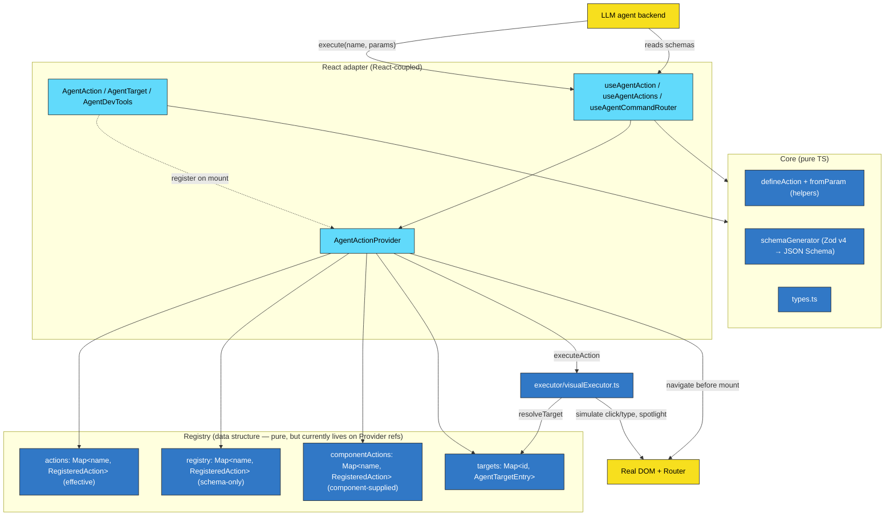
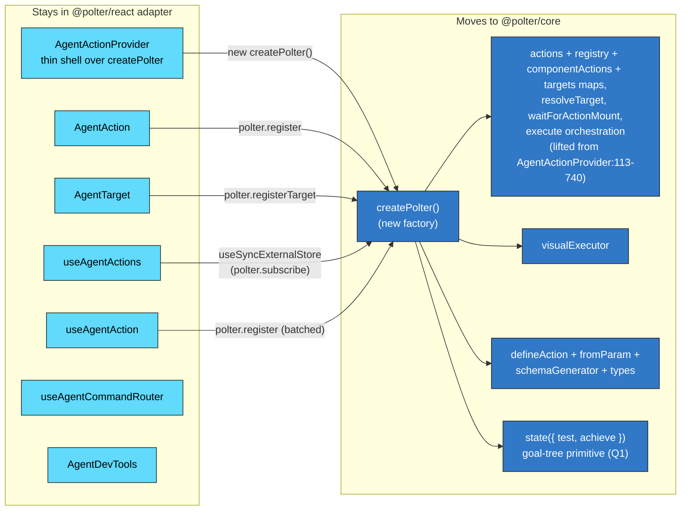
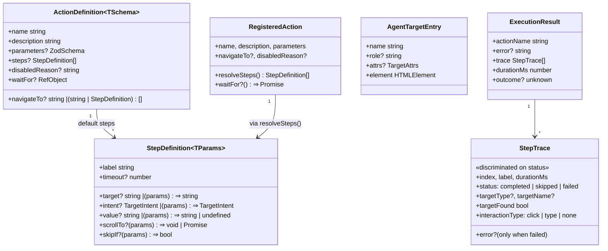
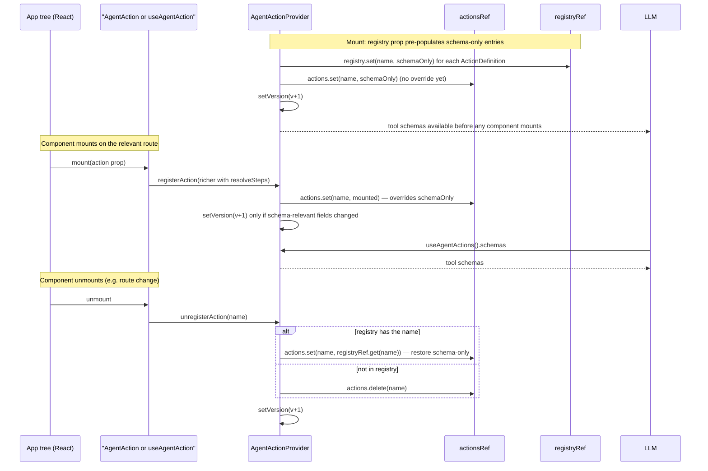
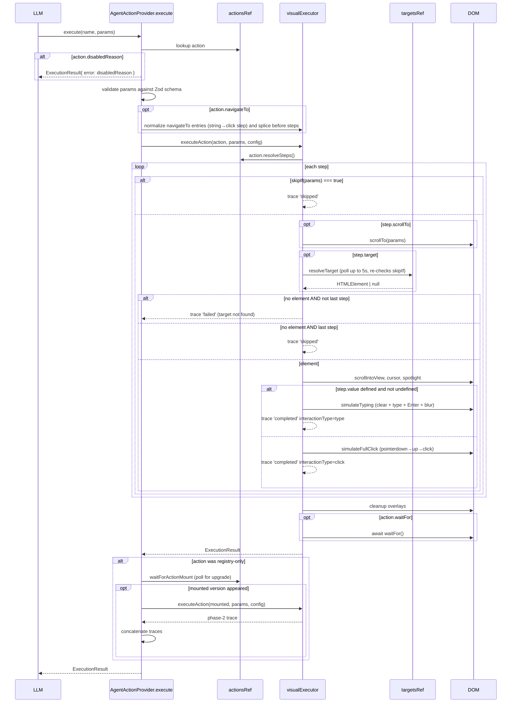
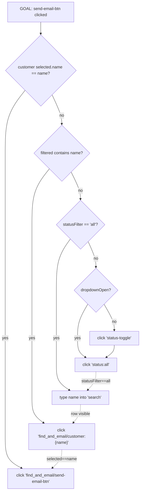

# Polter architecture — working document

A living architecture review of Polter. Maps the system as it stands, surfaces where the seams want to be, and tracks the open design questions (results from actions, async/abort, structured UI state, type safety, non-UI tools, navigation auto-gen, and whether the React coupling should change) as a substrate for triage.

The biggest current pain point is authoring `skipIf` chains for multi-step actions (see `examples/basic/src/App.tsx:162-186`); it's a symptom of the steps model being shaped wrong, and it shows up below as Q1 and Diagram 5.

---

## Current architecture

### 1. Layer overview — colored by React coupling

Cyan = React-coupled. Blue = pure TS (no React import). Yellow = external (LLM, DOM, Router).



**What this surfaces:** the React-coupled surface is _only_ the boxes in the top subgraph (Provider + 3 components + 3 hooks). Everything below — `core/`, the registry data structures, the executor — is already pure TS today. The cyan/blue line is roughly the same line as `src/components/` + `src/hooks/` vs. `src/core/` + `src/executor/`. The pure side contains all the _behavior_; the React side is mostly lifecycle wiring.

A subtlety worth flagging: the Provider keeps **three** action maps. `registryRef` holds the schema-only entries from the `registry` prop, so the LLM sees tool schemas before any component mounts. `componentActionsRef` holds the entries a mounted component registered via `useAgentAction`, kept separately so they can be merged with (or, on unmount, restored from) the registry version. `actionsRef` holds the active, effective version — when a component mounts, its richer entry (with steps) overrides the registry version; on unmount the registry version is restored. This is what lets a registry action click navigation targets, wait for the destination component to mount, then run the mounted component's steps.

### 1b. The React boundary, isolated

What would move into a framework-neutral `@polter/core` vs. stay in a `@polter/react` adapter, if we did the Phase 1 lift:



**What this surfaces:** the adapter surface is small (7 thin shells) and homogeneous (all just call `polter.register*` in lifecycle hooks). A `@polter/vue` or `@polter/vanilla` would mirror this same shape. `AgentDevTools` is the lone fat React-only component; it stays in the adapter because it _is_ a UI.

### 1c. Attribute-based target resolution (shipped)

Target lookup is no longer exact-name-only. A step may carry an optional `intent` (role + attrs), and an `AgentTarget` may carry a structured self-description (`role` + `attrs`) alongside its `name`. When the executor can't resolve a step's exact `target` name in the registry, `AgentActionProvider.resolveTarget` falls back to `matchTargets(connected, intent)` (`src/resolvers/`), scoring the step's intent against every registered target's self-description and logging the hit as `via: 'intent'`.

This makes resolution tolerant of the drift that used to break exact-name targets: a partial id-set, a label instead of an id, or a number-vs-string id still finds the right element. `matchTargets` returns a discriminated result — matched / ambiguous / miss with ranked candidates — so an ambiguous or absent match is reported rather than silently lost (`role` is a hard filter; attrs are token-normalised and scored by set-overlap; `MATCH_THRESHOLD = 0.5`, `AMBIGUITY_MARGIN = 0.15` in `src/resolvers/scoring.ts`).

The resolver is pure TS in `src/resolvers/` (no React), wired into both the Provider's `resolveTarget` and the executor's step loop. It complements the exact-name lookup rather than replacing it.

### 2. Type relationships



Things to notice:

- `StepDefinition` is generic on `TParams` (inferred from the action's Zod schema). `skipIf`, `value` (when a function), `target` (when a function), and `scrollTo` all receive the typed params.
- `target` is unified: a string for static names, or `(params) => string` for dynamic names like `find_and_email/customer:${p.name}`. There is no separate `fromParam`/`fromTarget` field anymore.
- `value` likewise: a string for literals (e.g. `''` to clear an input), or `(params) => string | undefined`. Returning `undefined` from the function falls through to a click instead of typing. The exported `fromParam('name')` helper is just sugar for `(p) => String(p.name)`.
- `RegisteredAction` exposes `resolveSteps()` rather than the steps array directly. The hook closes over the latest `configs` via a ref so closures stay fresh without re-registering on every render.
- `AgentTargetEntry` is independent of any action; encode action scope and/or row identity into the `name` (e.g. `name={`find_and_email/customer:${id}`}`).
- `ExecutionResult` has no `success` flag — error presence is the signal. `StepTrace` is a discriminated union on `status`, so once you've narrowed to `completed` you get `interactionType: 'click' | 'type'` and `targetFound: true` for free.

### 3. Registration lifecycle



### 4. Execute flow



Two execution-flow features that aren't immediately visible from the type diagrams:

- **Registry-driven navigation.** A registry-only action with `navigateTo` set clicks the named AgentTarget(s), then polls `actionsRef` until the matching component mounts (`waitForActionMount`, using `mountTimeout`). This is how you ship an LLM-callable schema before the component for that screen has rendered.
- **Two-phase execution with runtime-state adoption.** When a registry-only action runs, the Provider then gives the destination component a bounded window to mount (a short bounded poll — `HANDOFF_MOUNT_POLL_MS`, 150ms — after static steps, otherwise up to `mountTimeout`) and adopts its runtime state. One of three branches runs, depending on what the mounted component supplies: (1) **disabledReason adoption** — the component reports it can't proceed, so the result becomes that error; (2) **waitFor-only completion** — the action already ran its static registry steps, so only the component's `waitFor` is awaited, surfacing a structured `outcome`; (3) **full phase-2 steps** — a stepless registry action adopts the mounted component's actual steps and runs them, concatenating traces. This makes "navigate then act" composable without writing it as a goal tree by hand.
- **Re-checking `skipIf` during target polling.** `resolveTarget` is given a `skipCheck` closure; if a prior step's click triggered a state update that makes the current step unnecessary, the executor bails the wait early instead of timing out. This is a partial workaround for the same problem Q1 wants to solve at the design level.

### 5. The pain visualised — current `find_and_email` as a goal tree

The current linear `steps[]` form is implicitly encoding this tree, with `skipIf` doing the test work at every node:



Today the user authors this tree as a flat list of 5 steps, each carrying a hand-written `skipIf` that tests every prefix that might already be satisfied. Reading directly from `examples/basic/src/App.tsx:163-185`:

```ts
{ label: 'Type the name',       value: fromParam('name'), target: 'search',
  skipIf: ({ name }) => selected?.name === name || search === name },
{ label: 'Open status filter',  target: 'status-toggle',
  skipIf: ({ name }) => filtered.some((c) => c.name === name) || statusFilter === 'all' || dropdownOpen },
{ label: 'Reset to all',        target: 'status:all',
  skipIf: ({ name }) => filtered.some((c) => c.name === name) || statusFilter === 'all' },
{ label: 'Click the customer',  target: (p) => `find_and_email/customer:${p.name}`,
  skipIf: ({ name }) => selected?.name === name },
{ label: "Click 'Send email'",  target: 'find_and_email/send-email-btn' },
```

The `skipIf` on step 2 has to OR together three conditions because _any_ of them mean step 2 is unnecessary. Each step's predicate has to anticipate every state the prior steps might leave the world in. This is a flattened tree.

---

## Open questions

Each item: current state, leaning, what diagram or design move it implies. Numbered for reference in discussion.

### Q1. Step dependencies — flat list vs. goal tree

**Today:** `steps: StepDefinition[]` with hand-written `skipIf`. Authors flatten a tree into a list. The executor mitigates the worst case by re-evaluating `skipIf` during target polling, so a step whose precondition becomes true mid-poll bails instead of timing out — but the authoring shape is still a list.

**Leaning:** Lift to a `state({ test, achieve })` primitive in `core/`. Authors compose states; executor walks the tree depth-first with test-then-achieve. Authoring shape matches the actual data shape (see Diagram 5).

**Implications:** New core primitive (~300 LOC). Existing `steps[]` can lower onto it later. Doesn't affect agent-facing schema.

### Q2. Steps vs. actions — do we need both?

**Today:** Action = agent-callable operation (in schema). Step = internal interaction within an action.

**Leaning:** Keep both, at different levels. Agents reasoning about individual clicks (à la WebArena) is a different product; Polter's value is high-level operations. In a goal-tree world, "step" becomes "leaf interaction" rather than "list item" — same role, different shape.

**Implications:** No structural change. Type cleanup once Q1 lands.

### Q3. Should Polter expose structured UI state or hierarchies?

**Today:** Only `availableActions` (which actions are enabled, plus `disabledReason`) is exposed. State is opaque.

**Leaning:** Lightweight middle path — let actions/steps optionally surface their _current value_ (e.g., `find_and_email` schema includes `currentSelection: 'Sarah Chen'`). Falls out for free if Q1 lands: every `state({ test, ... })` node is queryable.

Out of scope (for now): full DOM/AX-tree dump, à la WebArena/Mind2Web. High token cost, requires opt-in declaration of what's surface-worthy.

**Implications:** New `getUIState()` API that returns `{ stateName: currentValue }`. Schema augmentation for actions to declare which states they read.

### Q4. Should actions return values, not just on failure?

**Today (partial):** `ExecutionResult { actionName, error?, trace, durationMs, outcome? }`. Error presence is the signal — the `success` boolean was removed in v2 in favor of error-as-narrowing. `outcome` already carries the value the action's `waitFor` promise resolved to, so an action can report a structured result (e.g. applied-immediately vs. confirmation-card-shown). What's still missing is a _declared_ return type: no `returns: ZodSchema` on `defineAction` and no generic `ExecutionResult<T>`, so the LLM can't see the shape up front.

**Leaning:** Yes. Add `returns: ZodSchema` to `defineAction` and a component-side `getResult: () => T` callback. Most natural for actions like `find_customer` (returns the record), `count_active` (returns the number). Doesn't conflict with anything.

**Implications:** Schema includes return type so the LLM knows. `ExecutionResult<T>` becomes generic. Backwards compatible (returns undefined when not declared).

### Q5. Async, abort, long-running actions

**Today:** `execute()` is async, awaits steps + `waitFor`. `AbortController` exists per-execution; calling `execute` again aborts the previous run. Most actions <1s.

**Leaning:** For long-running (export big CSV, run report), the Claude-Code-pattern is right: action returns a handle immediately, LLM gets initial result, can call `wait_for_action(handle)` later or do other reasoning in parallel. Mark with `longRunning: true` on `defineAction`. Default behavior (block until done) unchanged.

**Implications:** Two execute paths in the executor. New `wait_for_action` synthetic tool exposed via schemas. Handle storage in registry. Probably a v2 feature.

### Q6. More type safety

**Today (partial):** `ActionDefinition<TSchema>` is generic on the Zod schema, and `StepDefinition<TParams>` already infers `TParams` from `z.infer<TSchema>`, so `skipIf`, function-form `target`, and function-form `value` all receive typed params. What's still loose: the literal-string forms (`target: 'search'`, `value: ''`) aren't constrained against any schema, and `fromParam('name')` takes a `string` not `keyof TParams`.

**Leaning:** Tighten the remaining gaps. `fromParam<K extends keyof TParams>(key: K)` so misspellings caught at compile time. Optional brand on `target` strings to mark static vs. dynamic. Pure TypeScript work, no runtime impact.

**Implications:** Should land in same PR as Q1 (the goal tree gets the same generic).

### Q7. Auto-generate steps to navigate the UI tree

**Today:** Target-driven navigation via `defineAction.navigateTo`, mediated by the `registry` prop on `AgentActionProvider` and `waitForActionMount`. So "click a visible navigation target, wait, then run mounted steps" is built in. Composable navigation has shipped — but as **explicit step arrays**, not via the Q1 goal tree: `navigateTo` accepts a `ReadonlyArray<string | StepDefinition>` (string entries are AgentTarget names, step entries can be `optional` probes with a short `timeout`), so the responsive-nav choreography is authored once as a shared const and spread into feature actions' `navigateTo`. A string is always a target name, never an action name — one namespace. Multi-step nav (tab → modal → form) is still hand-authored as a `steps[]` array or a `navigateTo` step sequence.

**Leaning:** Falls out of Q1 + a navigation-target registry. "Reach state X" becomes a goal node; `defineAction.navigateTo` is one provider; tab/modal-open are other providers. The executor's existing depth-first walk handles it. No new primitive needed.

**Implications:** Q1 must land first. Then add a small navigation-target helper if needed to make "to be on this screen" composable without introducing URL-based shortcuts.

### Q8. Non-UI tool calls

**Today:** Every action drives DOM. No plain-function tools.

**Leaning:** Worth a tiny addition. `useTool({ name, parameters, run })` shares the registry with `useAgentAction`, but execution skips the executor entirely — calls `run(params)` and returns. Single schema list to the LLM, two execution paths internally. Agents like having one tool registry.

**Implications:** Add `kind: 'ui' | 'tool'` to `RegisteredAction`. Provider's `execute` branches on kind. Small.

### Q9. Should the React coupling go away (or get deeper)?

**Today:** React is structural — registry/targets/refs and context all live on the Provider's hooks. But the React layer is doing pedestrian work (managing two `Map`s, bumping a `version` counter, providing a context). Nothing exploits anything React-specific. See Diagram 1 — most of the system is already pure TS.

**Leaning:** Lift the registry into a framework-neutral `createPolter()` factory (Phase 1 from the earlier discussion). The Provider becomes a thin shell. This isn't a public-API change. Whether we ever publish `@polter/vanilla` or `@polter/vue` is a separate marketing call — the architectural boundary is worth having either way.

Hooking _deeper_ into React (fiber traversal, react-reconciler hooks, displayName-based auto-detection) was considered and dropped: React internals aren't a stable API, the wins (auto-target detection) are better delivered via a build-time codemod, and the things we actually want (idempotent steps, structured state) come from Q1, not from fiber visibility.

**Implications:** Lift `AgentActionProvider:113-740` (the function body — registry refs, registry-prop sync, register/unregister, resolveTarget, waitForActionMount, navigateTo normalization, execute) into `core/createPolter.ts`. Provider becomes ~50 LOC. `useSyncExternalStore` for subscriptions. Tests pass unchanged (black-box against public API). See Diagram 1b for the moves/stays split.

---

## Proposed direction (high-level, not yet a commit)

The diagrams suggest three reinforcing moves, in this order:

1. **Lift the registry into a framework-neutral `createPolter()` factory** (Q9 / Diagram 1b). The Provider becomes a thin React shell that wires lifecycle to the factory. Not user-visible.
2. **Add `state({ test, achieve })` and goal-tree execution** to `core/` (Q1). Ships alongside `steps[]`. Solves the `skipIf` pain. Unlocks Q3 (state queries) and Q7 (multi-hop auto-nav) for free.
3. **Pick off the additive items** in any order: type safety (Q6), action results (Q4), non-UI tools (Q8), long-running actions (Q5).

The "hook deeper into React" path stays dead. None of the above needs fiber visibility.

The framework-agnostic core path quietly happens as a side effect of step 1. Whether we ever ship `@polter/vue` or `@polter/vanilla` becomes a marketing question, not an architectural one.

---

## Critical files

| File                                     | LOC | Role                                                                                |
| ---------------------------------------- | --: | ----------------------------------------------------------------------------------- |
| `src/components/AgentActionProvider.tsx` | 740 | Three action maps + targets map + execute orchestration — Phase 1 lift target       |
| `src/executor/visualExecutor.ts`         | 807 | Step loop, element resolution, click/type/spotlight effects — Q1 target             |
| `src/core/types.ts`                      | 326 | All shared types — Q4/Q6 target                                                     |
| `src/core/helpers.ts`                    |  59 | `defineAction` + `fromParam` helper — Q4/Q6/Q8 target                               |
| `src/core/schemaGenerator.ts`            |  29 | Zod v4 → JSON Schema                                                                |
| `src/components/AgentAction.tsx`         |  26 | Convenience wrapper over `useAgentAction` + `<AgentTarget>`                         |
| `src/components/AgentTarget.tsx`         | 102 | Target registration + `MutationObserver` for nested mounts                          |
| `src/hooks/useAgentAction.ts`            |  53 | Hook-based registration; latest-config ref pattern                                  |
| `src/resolvers/scoring.ts`               | 135 | Attribute-based target matching — `matchTargets`, scoring, thresholds (see 1c)      |
| `src/resolvers/types.ts`                 |  67 | `TargetIntent` / `TargetAttrs` / match-result types                                 |
| `src/components/AgentDevTools.tsx`       | 686 | In-app dev UI for inspecting and running actions (React-only; stays in the adapter) |
| `examples/basic/src/App.tsx:162-186`     |   — | The `skipIf` pile — best case study for Q1                                          |

## Verification (when we start moving)

- Existing tests in `src/__tests__/` are black-box against the public API; they should pass through Phase 1 unchanged. Any failing test signals an unintended public-API change.
- `examples/basic` is the integration test: run `pnpm dev` from there and confirm `find_and_email` and `filter_and_export` still work end-to-end.
- For Q1, port `find_and_email` to `state()` form in a branch and verify both paths produce identical execution traces (`StepTrace[]`).
